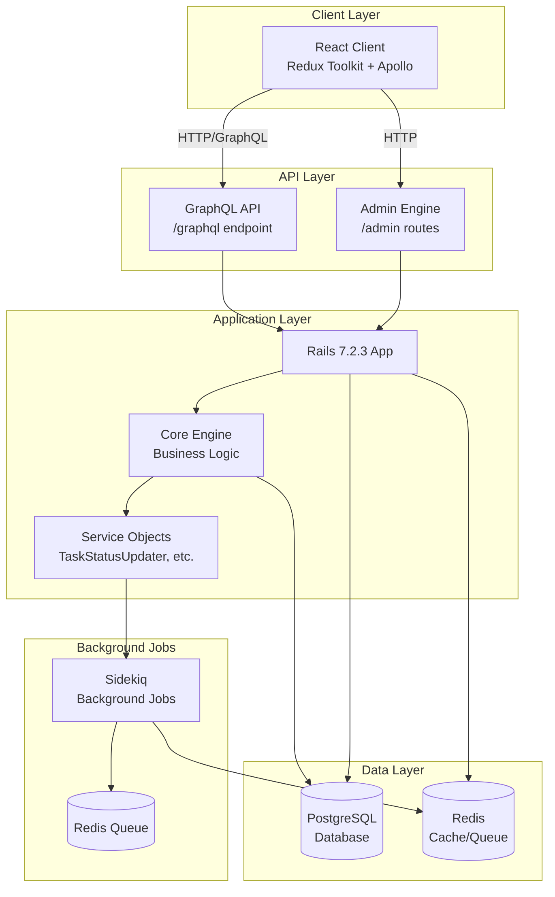
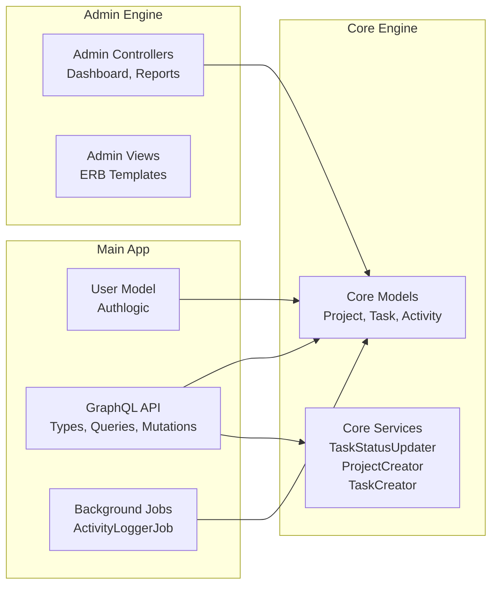
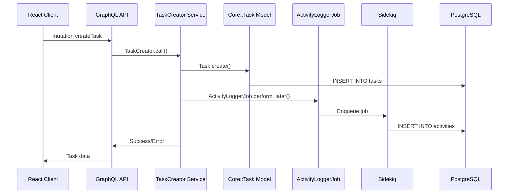
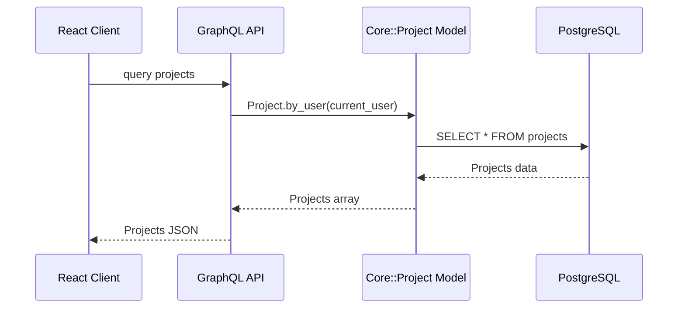
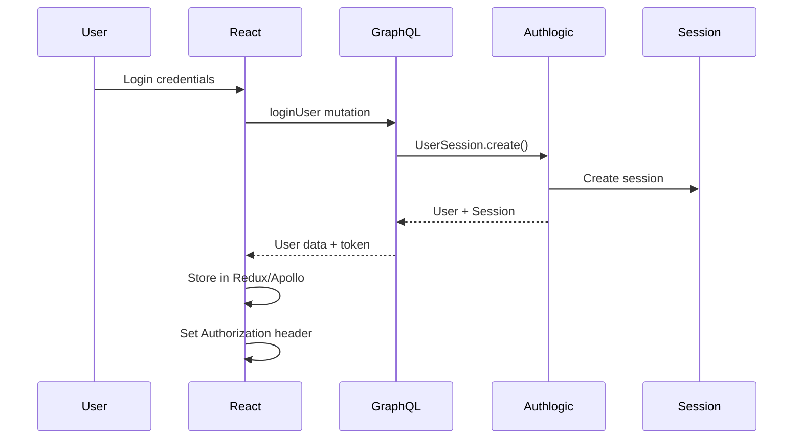
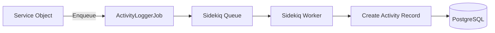
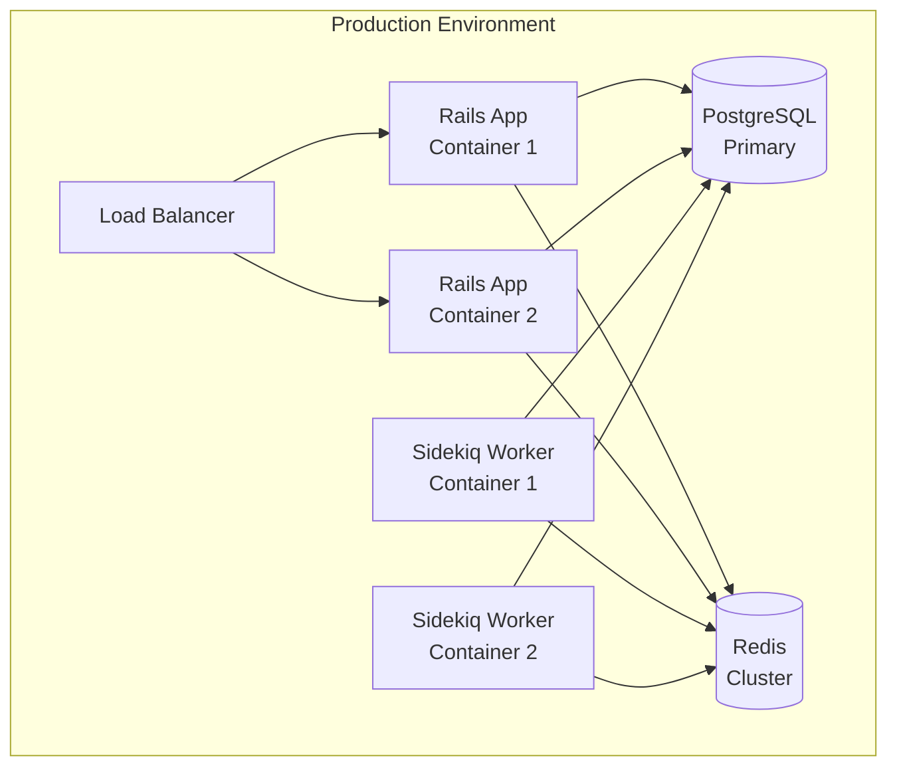

# Architecture Diagram - DevHub Training App

## System Architecture Overview

This document describes the architecture of the DevHub Training App, a modular Ruby on Rails application with a React frontend.

## High-Level Architecture



## Detailed Component Architecture

### Rails Application Structure



## Data Flow

### Request Flow: Create Task



### Request Flow: Query Projects



## Technology Stack

### Frontend
- **React 18**: UI framework
- **Redux Toolkit 2.10**: State management
- **Apollo Client 3.12**: GraphQL client
- **Tailwind CSS 4.1**: Styling

### Backend
- **Ruby 3.3.7**: Programming language
- **Rails 7.2.3**: Web framework
- **GraphQL (graphql-ruby)**: API layer
- **Authlogic 6.4**: Authentication
- **Sidekiq 7.3**: Background jobs

### Infrastructure
- **PostgreSQL 15**: Primary database
- **Redis 7**: Cache and job queue
- **Docker**: Containerization
- **Docker Compose**: Local development

## Engine Architecture

### Core Engine

The Core Engine contains the main business logic:

```
core/
├── app/
│   ├── models/core/
│   │   ├── project.rb      # Core::Project
│   │   ├── task.rb          # Core::Task
│   │   └── activity.rb      # Core::Activity
│   └── services/core/
│       ├── task_status_updater.rb
│       ├── project_creator.rb
│       └── task_creator.rb
└── lib/core/
    └── engine.rb
```

**Mounted at**: `/api` (currently no routes, used for namespacing)

### Admin Engine

The Admin Engine provides administrative interfaces:

```
admin/
├── app/
│   ├── controllers/admin/
│   │   ├── dashboard_controller.rb
│   │   └── reports_controller.rb
│   └── views/admin/
│       ├── dashboard/
│       └── reports/
└── lib/admin/
    └── engine.rb
```

**Mounted at**: `/admin`

## Authentication Flow



## Background Jobs Flow



## Deployment Architecture



## Security Architecture

- **Authentication**: Authlogic with session-based auth
- **Authorization**: User-scoped queries (users can only access their own projects/tasks)
- **API Security**: GraphQL queries require authentication
- **Background Jobs**: Secure job processing via Sidekiq
- **Database**: Parameterized queries via ActiveRecord

## Scalability Considerations

1. **Horizontal Scaling**: Rails app can be scaled horizontally behind load balancer
2. **Background Jobs**: Sidekiq workers can be scaled independently
3. **Database**: PostgreSQL can be replicated for read scaling
4. **Caching**: Redis used for session storage and job queue
5. **Engines**: Modular architecture allows independent scaling of features

---

**Last Updated**: 2025-11-17  
**Version**: 1.0

