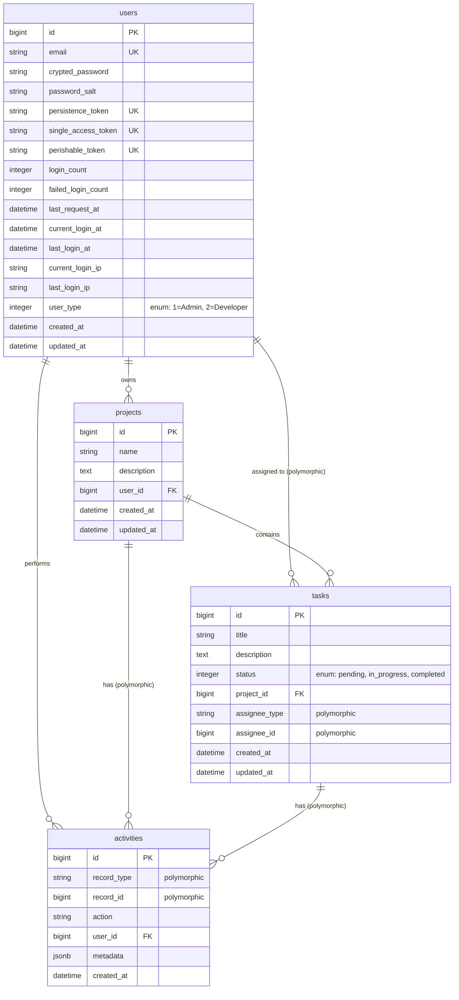

# Database Schema ERD - DevHub Training App

## Entity Relationship Diagram



## Database Schema Details

### Users Table

**Purpose**: Stores user authentication and profile information using Authlogic.

**Key Fields**:
- `email`: Unique email address (used for login)
- `crypted_password`: Encrypted password (bcrypt)
- `persistence_token`: Token for session persistence
- `login_count`, `failed_login_count`: Login statistics
- `current_login_at`, `last_login_at`: Login timestamps
- `user_type`: User type enum (1 = Admin, 2 = Developer, default: 1)

**Relationships**:
- `has_many :projects` (as owner)
- `has_many :assigned_tasks` (polymorphic, as assignee)
- `has_many :activities`

### Projects Table

**Purpose**: Stores project information owned by users.

**Key Fields**:
- `name`: Project name (required)
- `description`: Project description (optional)
- `user_id`: Foreign key to users table (owner)

**Relationships**:
- `belongs_to :user` (owner)
- `has_many :tasks`
- `has_many :activities` (polymorphic)

**Indexes**:
- Index on `user_id` for efficient user project queries

### Tasks Table

**Purpose**: Stores task information associated with projects.

**Key Fields**:
- `title`: Task title (required)
- `description`: Task description (optional)
- `status`: Enum field (pending: 0, in_progress: 1, completed: 2)
- `project_id`: Foreign key to projects table
- `assignee_type`: Polymorphic type (e.g., "User")
- `assignee_id`: Polymorphic foreign key

**Relationships**:
- `belongs_to :project`
- `belongs_to :assignee` (polymorphic, optional)
- `has_many :activities` (polymorphic)

**Indexes**:
- Index on `project_id` for efficient project task queries
- Index on `assignee_type` and `assignee_id` for polymorphic queries
- Index on `status` for status-based filtering

### Activities Table

**Purpose**: Audit log for tracking changes to projects and tasks.

**Key Fields**:
- `record_type`: Polymorphic type (e.g., "Project", "Task")
- `record_id`: Polymorphic foreign key
- `action`: Action performed (e.g., "created", "updated", "status_changed")
- `user_id`: Foreign key to users table (who performed the action)
- `metadata`: JSONB field for storing additional context (e.g., old_status, new_status)

**Relationships**:
- `belongs_to :record` (polymorphic)
- `belongs_to :user`

**Indexes**:
- Index on `record_type` and `record_id` for efficient polymorphic queries
- Index on `user_id` for user activity queries
- Index on `created_at` for time-based queries

## Relationships Summary

### One-to-Many Relationships

1. **User → Projects**: One user can own many projects
2. **User → Tasks**: One user can be assigned to many tasks (polymorphic)
3. **User → Activities**: One user can perform many activities
4. **Project → Tasks**: One project can have many tasks
5. **Project → Activities**: One project can have many activities (polymorphic)
6. **Task → Activities**: One task can have many activities (polymorphic)

### Polymorphic Relationships

1. **Tasks → Assignee**: Tasks can be assigned to different types of entities (currently only User)
2. **Activities → Record**: Activities can track changes to different types of records (Project, Task)

## Database Constraints

### Foreign Key Constraints

- `projects.user_id` → `users.id`
- `tasks.project_id` → `projects.id`
- `tasks.assignee_id` → `users.id` (polymorphic, when assignee_type = "User")
- `activities.user_id` → `users.id`
- `activities.record_id` → `projects.id` or `tasks.id` (polymorphic)

### Unique Constraints

- `users.email`: Unique email addresses
- `users.persistence_token`: Unique persistence tokens
- `users.single_access_token`: Unique single access tokens
- `users.perishable_token`: Unique perishable tokens

### Check Constraints

- `tasks.status`: Must be one of (0, 1, 2) representing (pending, in_progress, completed)

## Indexes

### Performance Indexes

1. **users**:
   - `email` (unique index)
   - `persistence_token` (unique index)
   - `user_type` (index for filtering by user type)

2. **projects**:
   - `user_id` (for efficient user project queries)

3. **tasks**:
   - `project_id` (for efficient project task queries)
   - `assignee_type, assignee_id` (composite index for polymorphic queries)
   - `status` (for status-based filtering)

4. **activities**:
   - `record_type, record_id` (composite index for polymorphic queries)
   - `user_id` (for user activity queries)
   - `created_at` (for time-based queries and sorting)

## Sample Queries

### Get all projects for a user
```sql
SELECT * FROM projects WHERE user_id = ?;
```

### Get all tasks for a project
```sql
SELECT * FROM tasks WHERE project_id = ?;
```

### Get all tasks assigned to a user
```sql
SELECT * FROM tasks 
WHERE assignee_type = 'User' AND assignee_id = ?;
```

### Get all activities for a task
```sql
SELECT * FROM activities 
WHERE record_type = 'Task' AND record_id = ?;
```

### Get recent activities for a user
```sql
SELECT * FROM activities 
WHERE user_id = ? 
ORDER BY created_at DESC 
LIMIT 10;
```

## Migration History

1. `20251108090000_create_users.rb` - Creates users table with Authlogic fields
2. `20251117175817_create_projects.rb` - Creates projects table
3. `20251117175958_create_tasks.rb` - Creates tasks table with polymorphic assignee
4. `20251117180136_create_activities.rb` - Creates activities table with polymorphic record

---

**Last Updated**: 2025-11-17  
**Database**: PostgreSQL 15  
**Schema Version**: 20251117180136

